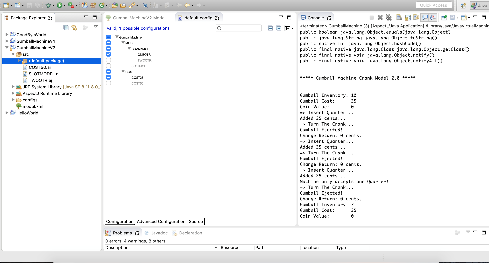
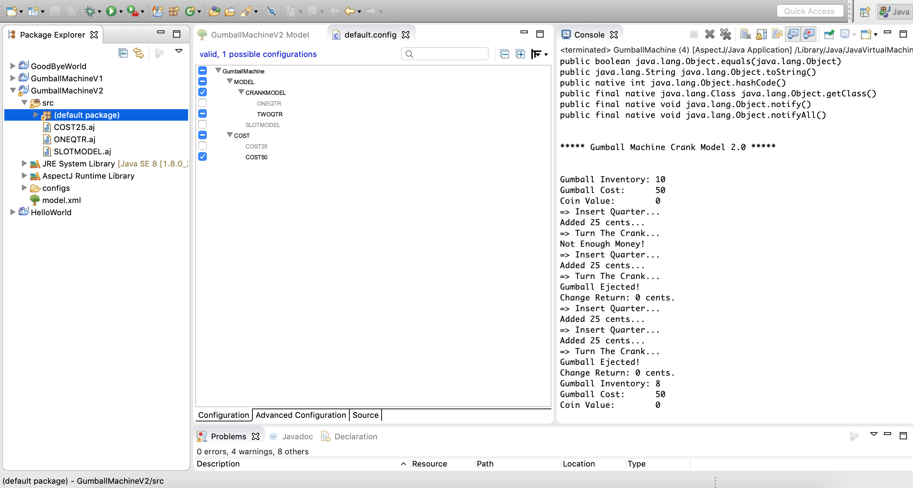
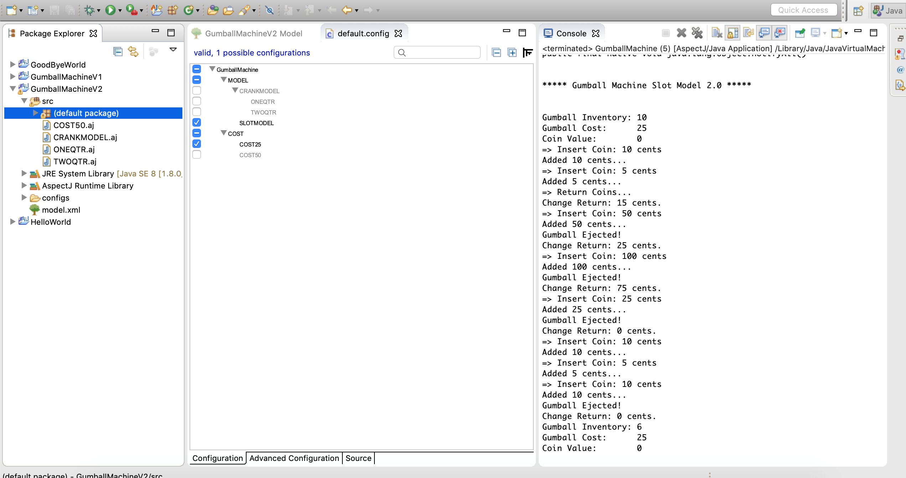
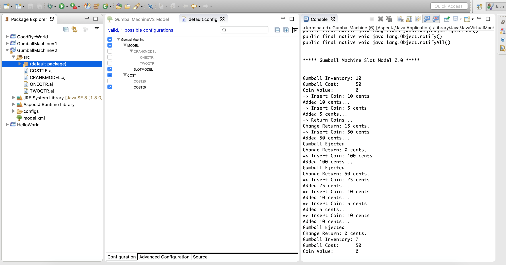

## __Comparison__

- Gumball Machine simulation using Feature IDE/Aspect code is much more modularized and well managed
than the original Gumball Machine simulation using Inheritance in Lab1. 

- Debuggability of the code is handled in a better way in solution using Feature IDE/Aspect than 
the original solution.

- Sequencing of the code events are simplified by using Feature IDE/Aspect solution.

- Changes can be easily done to the behaviour of the code at runtime by using Feature IDE/Aspect programming.

--------------------------------------------------------------------------------------------------------

1. Screenshot for Crank Machine supporting 25 Cents 
--------------------------------------------------------------------------------------------------------

  

2. Screenshot for Crank Machine supporting 50 Cents 
--------------------------------------------------------------------------------------------------------

  

3. Screenshot for Slot Machine supporting 25 Cents 
--------------------------------------------------------------------------------------------------------

  

4. Screenshot for Slot Machine supporting 50 Cents 
--------------------------------------------------------------------------------------------------------

  
